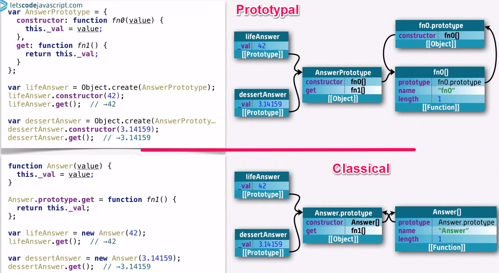
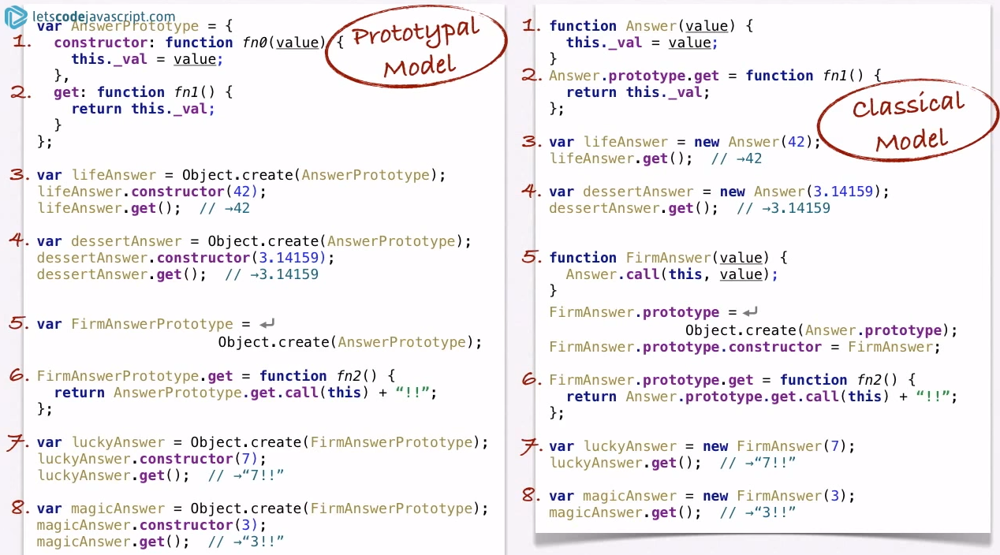

# Short guide about principles of OOP in JS

## Types
### Primitive Types
  * Boolean
  * Number
  * String
  * Null
  * Undefined

Identifying Primitives:
```javascript
typeof "text"; // "string"
typeof undefined; // "undefined"

var n = 2;
n.constructor.name; // "Number"
n.constructor === Number; // true

typeof null; // "object" - an error in JS
// to check if null use
value === null
```


### Reference Types
* Array
* Date
* Error
* Function
* Object
* RexExp


Dereferencing objects:

```javascript
var o = new Object();
o = null; // dereference - let garbage collectot free up memory
```

Identifying References:
```javascript
typeof myFun; // "function"
myFun instanceof Function; // true
listArr instanceof Array; // true
listArr instanceof Object; // true because Array was inherited from Object
Array.isArray(listArr); // true
```

## Functions

### arguments

```javascript
Array.isArray(arguments); // false

function myFn(par1) {
	arguments;
}

myFn.length; // 1 - function's arity - number of params that it's expecting
```

```js
var fn = function() {
    console.log(arguments.constructor.name); // Object
    var argsArr = Array.prototype.slice.call(arguments);
    console.log(argsArr.constructor.name); // Array
}
```

## Objects
### Detecting properties
```javascript
var o = {prop: false};

if (o.prop) {}; // incorrect
"prop" in o; // true, check both for own and prototype properties
o.hasOwnProperty("someMethod"); // checks only for own methods
```

### Types of Properties - accessors:
```javascript
var person = {
  _name: "Jack",

  get name() {
    console.log("Getting name");
    return this._name;
  },

  set name(value) {
    console.log("Setting name to %s", value);
    this._name = value;
  }
};

person.name
// Getting name
//"Jack"

person.name = "John"
// Setting name to John
// "John"
```

multiple properties:
```javascript
var person = {};
Object.defineProperties(person, {
	_name: {
    	value: "Jack",
        enumerable: true,
        configurable: true,
        writable: true
    },

    name: {
    	get: function() {},
        set: function() {},
        enumerable: true,
        configurable: true
    }
});
```

### Preventing Obj Modification

```javascript
var person = { name: "Jack "};

// preventExtensions
Object.preventExtensions(person);
Object.isExtensible(person); //false
person.lastName = "Smith";
person; // Object {name: "Jack "}

// seal
Object.seal(person); // nonextendable, nonconfigurable
delete person.name
person; // Object {name: "Jack "}
person.name = 'John'
person; // Object {name: "John"}

// freeze
Object.freeze(person); // snapshot of object, cannot be changed anything
```
## Constructors and Prototypes
#### Prototypes and Constructors
```javascript
function Person(name) {
	this.name = name;
}

// 1. in case of overwriting prototype
Person.prototype = {
	// 2. important to keep connection
    constructor: Person,

    sayName: function() {},
    toString: function() {}
};

var p1 = new Person("Jack");
p1 instanceOf Person; // true
p1.constructor === Person
```

## Inheritance
### Methods from `Object.prototype`
```javascript
valueOf(); // gets called whenever an operator is used on an object
var now = new Date(),
	earlier = new Date(2010, 1, 1);
now > earlier; // true, because 'getTime()' method was used as 'valueOf()'

toString(); // is called whenever valueOf() returns a reference value instead of primitive
```

### Object Inheritance
`Object.create()`
```javascript
var person1 = {
  name: "Jack",
  sayHi: function() { console.log("Hi, " + this.name); }
}

var person2 = Object.create(person1, {
  name: 'John'
});
var person2 = Object.create(person1, {
  name: {
    value: "John"
  }
});

person2.sayHi(); // Hi, John
person1.isPrototypeOf(person2); // true
```

### Constructor Inheritance

```javascript
// parent
function Parent() { this.p = 'parent'; }
Parent.prototype.parentMethod = function() { return 'parent method'; }

// child
function Child() { this.c = 'child'; }
Child.prototype.childMethod = function() { return 'child method'; }

// inheritance
Child.prototype = new Parent();
Child.prototype.constructor = Child;

// inherited object
var c = new Child();
// Child {c: "child", p: "parent", constructor: function, parentMethod: function}

// child prototype was overwritten and childMethod dissapeared

Child.prototype.constructor.name; // "Child"
```

similar with `Object.create()`
```javascript
Child.prototype = Object.create(Parent.prototype, {
  constructor: {
    value: Child
  }
});

var c = new Child();
// Child {c: "child", parentMethod: function}
// only prototype was inherited - parent's p was not
```
### Stealing constructor - `call` and `apply`
```javascript
// parent
function Parent() { this.p = 'parent'; }
Parent.prototype.parentMethod = function() { return 'parent method'; }

// child
function Child() { this.c = 'child'; Parent.call(this) }

// inheritance
Child.prototype = new Parent();
Child.prototype.constructor = Child;

var c = new Child();
// Child {c: "child", p: "parent", constructor: function, parentMethod: function}
// c has own values from Parent
```


### `getPrototypeOf`

```js
var personPrototype = {name: ''};
var ben = Object.create(personPrototype); // inherited obj

Object.getPrototypeOf(ben); // personPrototype
personPrototype.isPrototypeOf(ben); // true

```

## Classical vs Prototypal Inheritance




## Resources
1. http://www.objectplayground.com/ (https://www.youtube.com/watch?v=PMfcsYzj-9M)
2. Principles of Object-Oriented JavaScript by Nicholas C. Zakas (http://www.nostarch.com/oojs)
